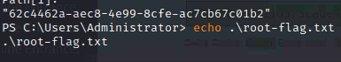
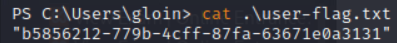

# Gloin Exploit
- IP: 10.0.5.31
### Ports
- 22 ssh Openssh for_Windows_7.7 (protocol 2.0)
- 443 ssl/http Apache httpd 2.4.51 ((Win64) OpenSSL/1.1.1l PHP/7.3.31)
- 3389 ms-wbt-server Microsoft Terminal Services
## Foothold
- dirbuster to find admin page
- sql OR 1=1 to login
- `id=8' union select 1,password,3,4,5,6,7 from admin_list--+` on exam page to get admin hash
- used john to reverse hash
## LOGIN for ssh
- username: Administrator
- password: F1r3Dr@g0n
## flags
- root:
- user:
## How to prevent
- Validate SQL fields
- Parameterize the queries to only allow specific inputs
- Salt the hashes
